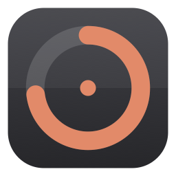
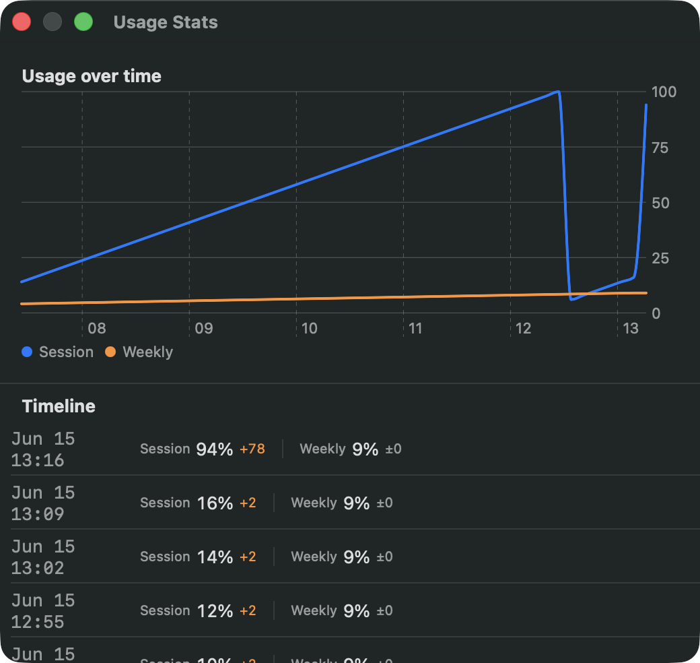

<div align="center">



# Claude Usage Tracker

**A tiny native macOS menu bar app that shows your Claude usage limits at a glance.**

[](https://github.com/AmirNcode/claude-usage-tracker-mac/actions/workflows/release.yml)


</div>

---

Claude Usage Tracker lives in your menu bar and shows two numbers:

```
58% / 6%
```

- **Left** — how much of your current **5-hour session** window you've used.
- **Right** — how much of your **7-day weekly** limit you've used.

Click it for the exact reset times, and open **Settings** to log in, pick colors,
and tune the refresh rate.

## Features

- 🧮 **Session & weekly usage** in the menu bar, updated automatically.
- 🎨 **Custom colors** for each percentage, with optional **threshold highlighting** —
  turns **orange at 90%** and **red at 100%** so you notice before you run out.
- 🔌 **Connect your Claude account** with a browser login, or let it read
  [Claude Code](https://claude.com/claude-code)'s session automatically if it's installed.
- 📈 **Usage stats** — a Stats window with a timeline chart and a change-by-change
  log, so you can see how your prompting moves the needle.
- 🪶 **Native and lightweight** — Swift + AppKit/SwiftUI, no Electron, ~1 MB, negligible memory.
- 🚀 **Launch at login**, configurable refresh interval, and a clean Settings window.

## Menu

Clicking the menu bar item shows:

```
Session   58% - 16:29       ← used % and when the 5-hour window resets (local time)
Weekly    6%  - Mon 05:59   ← used % and when the weekly window resets (local time)
──────────────
Stats…
Refresh Now
Settings…
Quit
```

## Usage stats

<div align="center">

</div>

**Stats…** opens a window with a line chart of session/weekly usage over time, plus
a timeline that logs each change — e.g. `Jun 15 13:16 — Session 94% (+78) · Weekly
9% (±0)`. While the window is open the app samples more often so prompt-driven jumps
show up quickly.

> [!NOTE]
> The usage endpoint only reports the **aggregate** session/weekly percentages —
> there's no per-message breakdown. So Stats shows *when usage changed and by how
> much*, which you can line up with what you were doing; it can't attribute a jump
> to one specific prompt. History is stored locally for the last 14 days.

## Install

### Download (recommended)

1. Grab the latest `ClaudeUsageTracker.dmg` from
   [**Releases**](https://github.com/AmirNcode/claude-usage-tracker-mac/releases).
2. Open it and drag **Claude Usage Tracker** to **Applications**.
3. First launch: because the app isn't notarized yet, right-click it →
   **Open** → **Open** to bypass Gatekeeper (only needed once).

### Build from source

Requires macOS 14+ and the Swift toolchain (Xcode Command Line Tools are enough —
no full Xcode needed).

```sh
git clone https://github.com/AmirNcode/claude-usage-tracker-mac.git
cd claude-usage-tracker-mac
make install      # build the .app, copy to /Applications, launch
```

Other targets:

```sh
make test         # run the unit tests
make app          # build build/ClaudeUsageTracker.app
make dmg          # build a distributable build/ClaudeUsageTracker.dmg
make status       # print current usage in the terminal (no GUI)
```

## Connecting your account

The app needs a Claude token to read usage. It tries, in order:

1. **Your own login** — open **Settings → Account → Log in with Claude…**. A browser
   window opens; approve access, copy the code it shows, and paste it back into the app.
   The app stores its own token in your Keychain and refreshes it automatically.
2. **Claude Code's session** — if you have [Claude Code](https://claude.com/claude-code)
   installed and logged in, the app reads its Keychain token (read-only — it never
   modifies or refreshes Claude Code's credentials).

> [!IMPORTANT]
> There is no official public usage API. This app uses the same private endpoint
> and OAuth client that Claude Code uses. That means the login flow is
> **unofficial and may break or change** at any time, and could be subject to
> Anthropic's terms. The Claude Code fallback keeps the app working even if the
> login flow stops working. Use at your own discretion.

## Settings

Settings open in a window with a left sidebar; a single button in the top-right
corner shows or hides the sidebar.

| Section | Options |
|---------|---------|
| **Account** | Connection status, last refreshed time, last error, Log in / Log out |
| **Appearance** | Threshold highlighting (orange ≥90%, red ≥100%), custom colors for session & weekly % |
| **General** | Launch at login, refresh interval (1–15 min), Refresh now |
| **About** | Version, links to this repo and the issue tracker |

## How it works

```
┌─────────────┐   token    ┌──────────────┐   GET /api/oauth/usage   ┌──────────┐
│ AuthManager │ ─────────▶ │  UsageClient  │ ───────────────────────▶ │ Anthropic │
│  OAuth /    │            │ (cache-free,  │                          │  usage    │
│ Claude Code │ ◀───────── │  429 backoff) │ ◀─────────────────────── │ endpoint  │
└─────────────┘            └──────────────┘      five_hour/seven_day  └──────────┘
```

It polls every few minutes (5 by default), backs off and respects `Retry-After`
when rate-limited, and refreshes immediately when your Mac wakes from sleep.
Usage windows change slowly, so a low polling rate is plenty and avoids tripping
the endpoint's rate limit.

The codebase is split for testability:

```
Sources/UsageCore/            pure, unit-tested logic: API parsing, formatting,
                              usage levels, OAuth/PKCE, token model, usage client
Sources/ClaudeUsageTracker/   app shell: menu bar, SwiftUI settings, auth, keychain
Tests/UsageCoreTests/         assertion-based test runner (CLT toolchain ships no XCTest)
scripts/                      icon generation, .app bundling, DMG packaging
.github/workflows/release.yml tag a vX.Y.Z → builds, tests, attaches a DMG to the release
```

## Troubleshooting

- **`–% / –%` in the menu bar** — not connected. Open Settings → Account and log in,
  or install and log in to Claude Code.
- **Numbers look frozen** — check Settings → Account → *Last error*. If you see
  "Rate limited", the app is backing off and will recover automatically; increasing
  the refresh interval helps.
- **Diagnostics** — errors are appended to `~/Library/Logs/ClaudeUsageTracker.log`.

## Contributing

Issues and PRs welcome. Run `make test` before submitting. The pure logic in
`Sources/UsageCore` is covered by tests; please keep it that way.

## License

[MIT](LICENSE) © 2026 Amir
